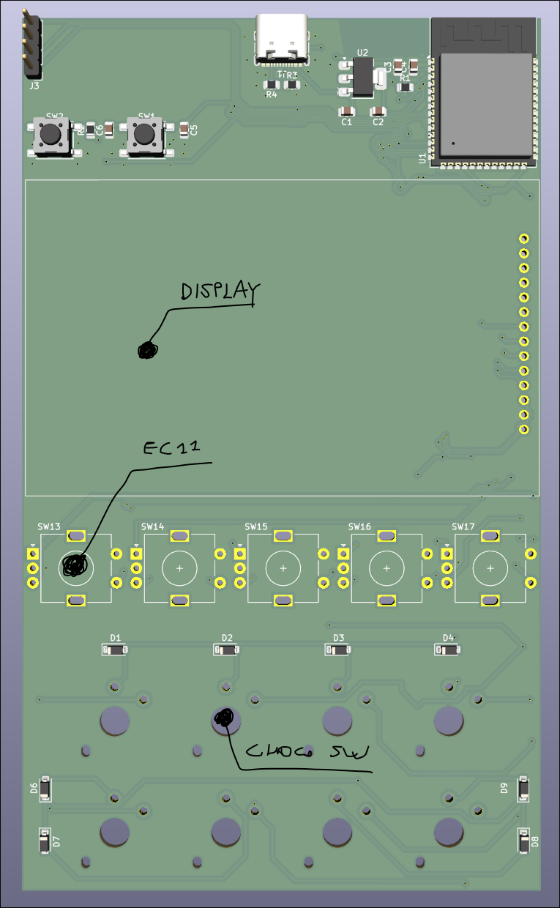
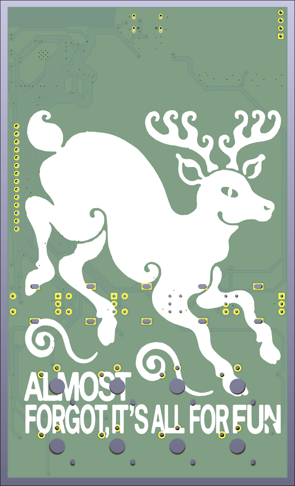

# TinyPad

> Work in progress — early development stage across all areas.

TinyPad is a custom macro pad and audio mixer controller built around the ESP32-S3. It features physical encoders and buttons for controlling audio levels and triggering actions, a display for real-time feedback, and software integration with applications like OBS, Photoshop, and others. It communicates with a PC driver that exposes per-application controls and automation.

---

## PCB Development — 35%

A custom board designed around the ESP32-S3. Currently still in a dev board phase, with layout and design rules not fully optimized. A rerouting pass is planned to fix annular ring sizes, differential pair length matching, and trace distances.

  
  &nbsp;
  

**To do:**
- Reroute with correct DRC constraints
- Fix via sizes (annular ring ≥ 0.15 mm)
- Fix D+/D− length matching
- Transition from dev board to final form factor

---

## Firmware Development — 20%

Only a partial GUI implementation is done. Most of the core functionality is missing.

**To do:**
- GPIO handling
- Peripheral drivers (encoders, buttons, display)
- Communication integration
- System logic and state management

---

## Communication — 30%

Basic communication works but the protocol is incomplete and a lot is still missing.

**To do:**
- Define and finalize the protocol
- Error handling and reconnection logic
- Testing and validation

---

## PC Driver & GUI — 0%

Not started.

**To do:**
- PC-side driver
- GUI application
- Communication with the device

---

## Summary

| Area | Status | Progress |
|---|---|---|
| PCB | Dev board, needs rerouting | 35% |
| Firmware | Partial GUI only | 20% |
| Communication | Works but incomplete | 30% |
| PC Driver & GUI | Not started | 0% |
